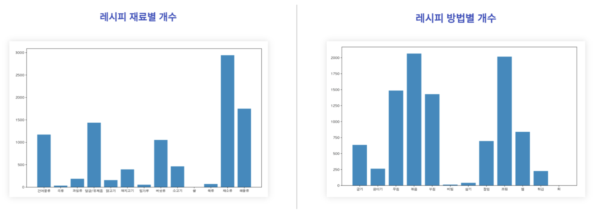
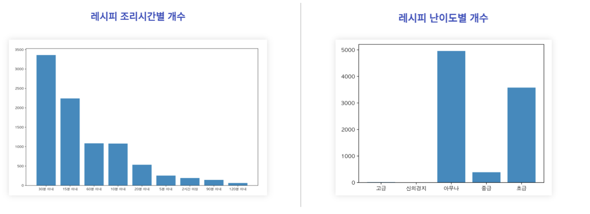
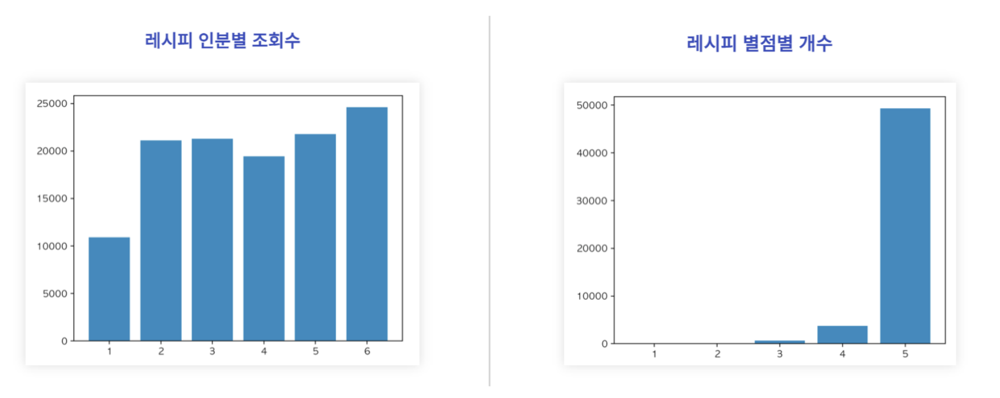
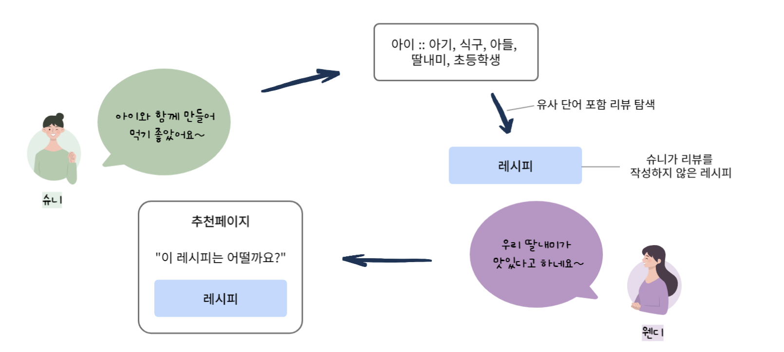

# '만개의 레시피’ 데이터를 활용한 추천 시스템 - 레시피와 리뷰를 중심으로

## 프로젝트 배경
* 브랜드관 쉐프
    * 상업형 모델인 브랜드관 쉐프는 기존 일반 사용자들의 커뮤니티에서 상업형 모델로 확장된 형태
    * 브랜드관 쉐프에 입점한 쉐프들은 자유롭고 독립적인 마케팅을 할 수 있으나, 추가 홍보 방법은 유료로 진행 가능. &rarr; 장기적인 관점에서 이용자의 이탈 초래
* 이용자 맞춤 시각화 부족
    * 홈페이지 내 이용자가 자신의 정보를 확인할 수 있는 MY홈에 접근했을 경우, 레시피, 요리후기, 댓글 등을 보여주나 이를 조금 더 발전시키고자 함
    * 이용자 맞춤 레시피, 쉐프 등을 추천해주는 시각화를 추가하고, 이용자 행태에 맞춰 개인화된 맞춤 서비스 제공

## 기대 효과
* 고객이 필요로 하는 가치 추천과 고객 요구 만족을 통한 이용자 맞춤 서비스 장점 강화
* 개인 맞춤화된 시각화와 추천 제공을 통한 이용자 만족도 강화
* 고객 데이터 분석과 이용자 행동 분석 가능

## 데이터 수집
* '[만개의 레시피](https://www.10000recipe.com/)' 사이트 크롤링
* 레시피 dataframe / 리뷰 dataframe 총 두 개의 dataframe으로 크롤링 저장

### recipe_main.csv 데이터 타입
* columns 총 개수: 16개

|col. name|type|비고|
|:---:|:---:|:---:|
|index|int|요리 레시피 고유번호|
|종류별|str|밑반찬, 메인반찬, 국/탕, 찌개, 디저트, 면/만두, 밥/죽/떡, 퓨전, 양념/잼/소스, 양식, 샐러드, 스프, 빵, 과자, 차/음료/술 중 하나|
|상황별|str|-|
|재료별|str|-|
|방법별|str|-|
|제목|str|-|
|url|str|레시피 작성된 주소|
|조회수|str|-|
|셰프|str|-|
|인분|int|ex. 3 : 3인분|
|조리시간|str|-|
|난이도|str|-|
|재료|list|-|
|인트로|str|요리 알려주기 전에 작성된 문구|
|조리순서|list|조리 순서대로|
|해시태그|list|-|

### recipe_review.csv 데이터 타입
* columns 개수: 6개

|col. name|type|비고|
|:---:|:---:|:---:|
|index|int|요리 레시피 고유번호|
|닉네임|str|요리후기 작성한 닉네임|
|작성날짜|str|-|
|작성시간|str|-|
|별점|str|-|
|내용|str|후기|

## 데이터 탐색

    

    

    

## 리뷰 데이터
### 전처리
1. [PyKoSpacing](https://github.com/haven-jeon/PyKoSpacing)을 이용한 리뷰 띄어쓰기 교정
2. [Hanspell](https://github.com/ssut/py-hanspell)을 이용한 한국어 맞춤법 교정
3. [Khaiii](https://github.com/kakao/khaiii)를 이용한 POS Tagging (형태소 분석)
3. POS Tagging된 리뷰 데이터에서 불용어 제거 &rarr; 필요 형태소 추출 &rarr; 토큰화

### 모델링

    

### 결과

## 레시피 데이터
### 전처리
1. 조회수, 조리시간 columns : str &rarr; int
2. 난이도 column &rarr; 서열처도로 변환  
    {NaN, 아무나, 초급, 중급, 고급, 신의경지} &rarr; {0, 1, 2, 3, 4, 5}
3. 재료별, 방법별 columns &rarr; one-hot encoding

### 모델링
* clustering

### 결과

## 레시피 해시태그 데이터
### 전처리
1. 특수문자 제거
2. 문장으로 작성된 해시태그 &rarr; 띄어쓰기로 나누어 단어 단위로 저장

### 모델링
* word2vec을 통해 embedding 진행
* word2vec에서 제공하는 유사도 기반으로 검색 엔진 발전
    * 사용자가 검색한 키워드만 검색되는 것이 아니라, 그 단어와 가장 유사한 단어에 대한 레시피도 보여줌

### 결과

